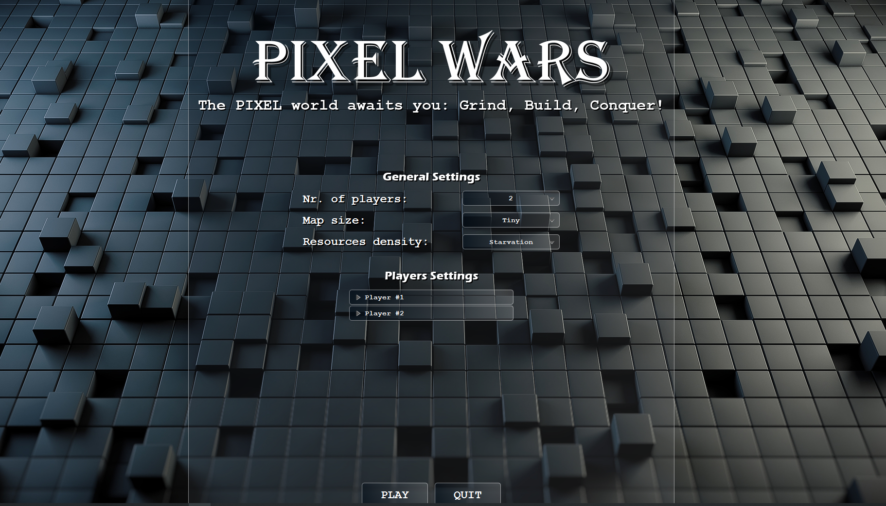
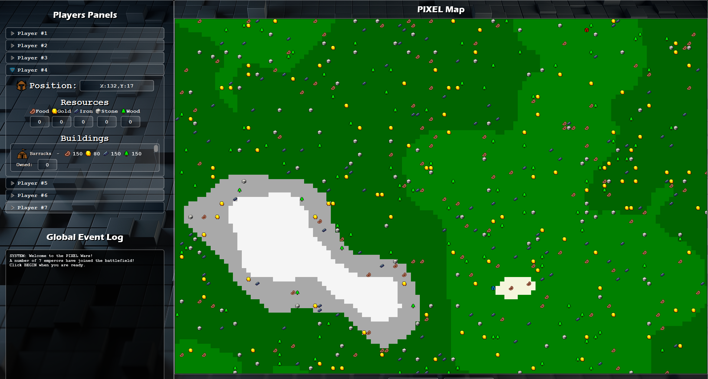
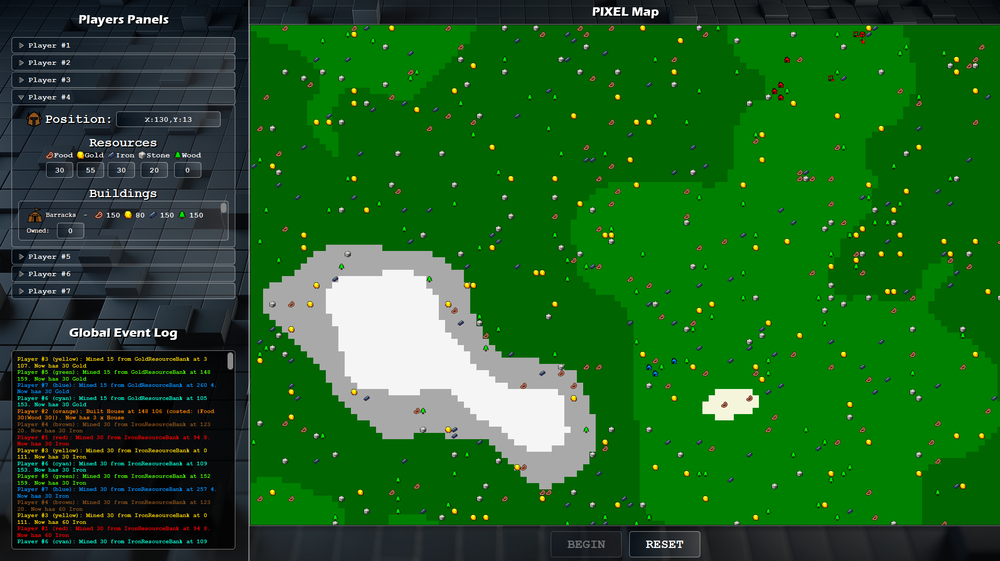

# Pixel Wars
Pixel Wars is a strategy game written in Java and tries to use concepts of Concurrent And Event Based Programming.
A detailed description is found in Documentation-PIXEL-Wars-CEBP.pdf

